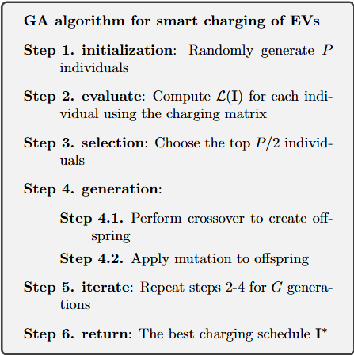
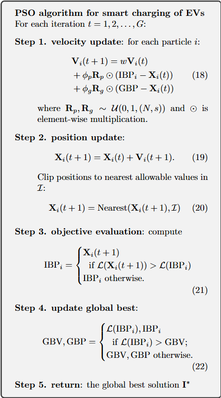
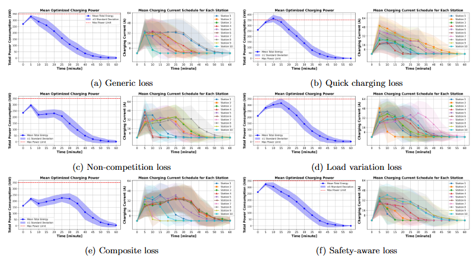
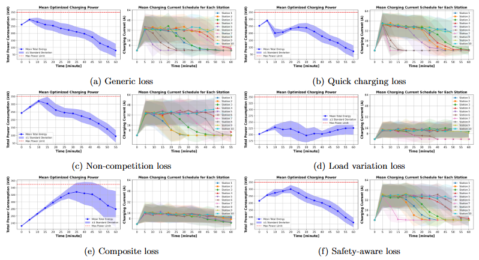

# Some Optimization Strategies for Smart Charging of Electric Vehicles
This repository contains the source code for the paper titled **"Some Optimization Strategies for Smart Charging of Electric Vehicles"** by Minh-Hieu Tran, Nam-Hai Nguyen, Phuong-Nam Nguyen from the School of Computing at Phenikaa University.

## Abstract
Efficient smart charging solutions are essential as electric vehicle (EV) adoption increases, driving sustainability and climate action. This study addresses the challenges of optimizing EV charging using Genetic Algorithms (GA) and Particle Swarm Optimization (PSO). We analyze five existing objective functions and introduce a novel safety-aware loss function to ensure charging reliability and grid safety. By evaluating 12 optimization strategies through numerical experiments, we provide insights into their performance, scalability, and limitations. Our findings offer actionable recommendations for implementing smart charging hubs, aiding policymakers, urban planners, and technology developers in promoting sustainable EV integration.

## Repository Structure
- `code/`: Implementation of GA, PSO algorithms, also provide numerical results as well
- `images/GA-alg.png`: Steps of implementing GA 
- `images/PSO-alg.png`: Steps of implementing PSO
- `images/GA-results.png`: Optimization results of GA
- `images/PSO-results.png`: Optimization results of PSO

## Prerequisites
- Python 3.7.0 or higher

## Framework and Approach
### Problem Statement
Let N be the number of stations in the charging hub, which is equal to the maximum number of EVs. In our experiment, we use 10 stations, as well as the number of EV.  

**Technical Glossary**
- F = 50000 (W) = 50 (kW), we assume that each EVs has the same maximum capacity battery
- U = 220 (V), fixed voltage for the Vietnamese market.
- $I_{option} = \{8, 16, 32, 48, 64\} (A)$, the controllable charging current. 
- $P = U \cdot I \quad (W)$, the maximum required power (extreme case) is $10 \times 50 = 500 (kW)$
- $P_{allowance} = 350 (kW)$, we set the maximum allowable power to the 70% of the extreme case to avoid overloading of the charging hub.
- $t_0 = 0, t_{max} = 60, s = 13, \Delta t = \frac{t_1 - t_0}{s - 1} = 5 \quad minutes$, the control horizon is 60 minutes, divided into 13 time steps. 
- The power consumption as a matrix can be presented as below: 

$$
\mathbf{P} = U\cdot\mathbf{I} = 220\cdot \begin{bmatrix}
    I_{0,0} & I_{0,1} & \dots &I_{0,12}\\
    I_{1,0} & I_{1,1} & \dots &I_{1,12}\\
        & & & \\
    I_{9,0} & I_{9,1} & \dots &I_{9,12}\\
\end{bmatrix}
$$
- $CI_p = (I_{p,0}, I_{p,1}, ... , I_{p, s-1})$, the sequence is a charging configuration of an individual EV. Where control current $I_{p,q}$ with $p \in [0, N-1]$, and $q \in [0, s-1]$ since the power matrix P is $N \times s$.
- $CP(T) = 220 \cdot \sum_{p=0}^{N-1} I_{p, T}$, the power of all stations used at time $T \in [0, s-1]$. 
- $\mathcal{C} := \text{CP(T)} \leq P_{allowance}; \forall T \in [0, s-1]$, constrain of $P_{allowance}$.
- For some objective function $\mathcal{L}$, we find $$\mathbf{I}^* = \arg \max \mathcal{L}(\mathbf{I}|\mathcal{C})$$ where $\mathbf{I}^*$ is the optimal value of $\mathbf{I}$ that maximize the objective function with the constrain.  
### Algorithms
**Genetic Algorithm (GA)**: Inspired by natural selection, GA evolves solutions through selection, crossover, and mutation.



**Particle Swarm Optimization (PSO)**: Mimics social behaviors of swarms, balancing exploration and exploitation for optimized solutions.



### Objective function
1. **Generic objective function $[\mathcal{L}^{\text{Comp}}(\mathbf{I}|\mathcal{C})]$**

$$
fit = - max\{0, CP(T) - P_{allowance}\}
$$

```python
def GenericLoss(I):
    column_sum = I.sum(axis=0)
    excess_power = np.maximum(0, column_sum - max_power_limit)
    fitness_value = -np.sum(excess_power)  
    return fitness_value
```

2. **Quick Charging objective function $[\mathcal{L}^{\text{QC}}(\mathbf{I}|\mathcal{C})]$**

$$
fit := \mathcal{L}^{QC} (I) = \sum_{T = 0}^{s-1} \frac{s- T}{s-1} \cdot CP(T)
$$
```python
def QuickChargeLoss(particle):
    total_quick_charge = 0
    for T in range(s):
        prefactor = (s - T) / (s - 1)  
        CP_T = np.sum(particle[:, t])  
        fitness_value += prefactor * CP_T  
    return fitness_value
```

3. **Non-completion penalty $[\mathcal{L}^{\text{NC}}(\mathbf{I}|\mathcal{C})]$**

$$
fit := \mathcal{L}^{NC} (I) = -Penalty^{1/\alpha}
$$

$$
Penalty = \sum_{i = 0}^{N-1} (\text{Energy Shortfall}_i)^{\alpha}
$$

$$ 
\begin{equation*}
Energy Shortfall_i = |\text{Total Energy}_i - E_{required, i}|
\end{equation*}
$$

$$ 
Total Energy_i = \sum_{j=0}^{s-1} I_{i,j} \cdot U \cdot \Delta t 
$$

```python
def NonCompetitionLoss(particle, alpha):
    penalty = 0
    for i in range(N):
        total_energy = np.sum(particle[i, :] * U * Delta_t)
        energy_shortfall = abs(total_energy - E_required[i])
        penalty += energy_shortfall ** alpha
    fitness_value = -penalty**(1/alpha)
    return fitness_value
```

4. **Load Variation objective function $[\mathcal{L}^{\text{LV}}(\mathbf{I}|\mathcal{C})]$**

$$
fit := \mathcal{L}^{LV} (I) = - \sum_{q = 0}^{s-1}(\sum_{p=0}^{N-1} I_{p,q})^2 
$$

```python
def LoadVariationLoss(particle):
    fitness_value = 0
    for t in range(s):
        N_t = np.sum(particle[:, t])
        fitness_value += -N_t ** 2
    return fitness_value
```

5. **Composite objective function $[\mathcal{L}^{\text{Comp}}(\mathbf{I}|\mathcal{C})]$**

$$
    \mathcal{L}^{\text{Comp}} (\mathbf{I}) = w_{\text{QC}}\mathcal{L}^{\text{QC}} (\mathbf{I})+ w_{\text{NC}}\mathcal{L}^{\text{NC}} (\mathbf{I})+ w_{\text{LV}}\mathcal{L}^{\text{LV}} (\mathbf{I}),
$$

$\quad \quad \text{where} \quad w \in [0,1]$.

6. **Safety-aware objective function $[\mathcal{L}^{\text{SA}}(\mathbf{I}|\mathcal{C})]$**

$$
fit := Reward - Penalty
$$

$$
Reward = \sum_{T=0}^{s-1}[-|CP(T) - P_{max} | + P_{allowance}]
$$

$$
Penalty = \sum_{T=0}^{s-1} [max(0, CP(T)) - P_{allowance}]^2
$$

```python
def SafetyAwareLoss(I):
    column_sum = I.sum(axis=0)  
    target_range = 0.05 * max_power_limit  
    reward = np.sum(-np.abs(column_sum - max_power_limit) + max_power_limit)
    excess_power = np.maximum(0, column_sum - max_power_limit)
    penalty = np.sum(excess_power ** 2)
    fitness_value = reward - penalty
    return fitness_value
```

## Results
### Performance Insights
**GA Observation**



$$\text{Optimization result for smart charge scheduling of EVs using GA algorithm}$$

- Only $GA-\mathcal{L}^{QC}$ and $GA-\mathcal{L}^{Comp}$ occasionally exceed the power threshold ($P_{allowance}$)
- Schedules high power loads in the first 0–10 minutes, then gradually decreases, ensuring all EVs are charged.

**PSO Observation**



$$\text{Optimization result for smart charge scheduling of EVs using PSO algorithm}$$

- Distributes the load more evenly, except for $PSO-\mathcal{L}^{Gen}$
- $PSO-\mathcal{L}^{LV}$ and $PSO-\mathcal{L}^{Comp}$ may leave some EVs uncharged due to load variation constraints.

#### Conclusion
GA explores a larger solution space, leading to higher variation in results compared to PSO's steadier but sometimes limited optimization. Safety-Aware Objective function successfully balances power usage close to capacity without exceeding limits in both GA and PSO.

### Effective Analysis

|                  | GA     | PSO    |
|------------------|--------|--------|
| $\mathcal{L}_{\text{Gen}}$   | 1.63 [s] | 1.26 [s] |
| $\mathcal{L}_{\text{QC}}$    | 2.01 [s] | 1.98 [s] |
| $\mathcal{L}_{\text{NC}}$    | 2.09 [s] | 1.82 [s] |
| $\mathcal{L}_{\text{LV}}$    | 1.96 [s] | 1.47 [s] |
| $\mathcal{L}_{\text{Comp}}$  | 3.19 [s] | 3.13 [s] |
| $\mathcal{L}_{\text{SA}}$    | 1.71 [s] | 1.34 [s] |


- PSO is faster, with an average runtime of 1.83s (12.9% faster than GA’s 2.10s).
- Largest speed gain: $PSO-\mathcal{L}^{LV}$ (25% faster than GA).
- Smallest speed gain: $PSO-\mathcal{L}^{QC}$ (1.5% faster than GA).
- PSO's efficiency makes it suitable for time-critical applications, particularly for $\mathcal{L}^{Gen}, \mathcal{L}^{NC}, \mathcal{L}^{LV}$.

## Acknowledgements
The authors would like to express their gratitude to colleagues at Phenikaa University of FPT for their stimulating discussions and support during the hackathon.

## Citation
If you find this work useful, please cite the following paper:  
```bibtex
@article{tran2024Evs, 
  title={Some Optimization Strategies for Smart Charging of Electric Vehicles},
  author={Minh-Hieu Tran and Nam-Hai Nguyen and Phuong-Nam Nguyen},
  journal={...},
  year={2024}
}
```
You can also read the preprint version of our paper on [OpenReview](https://openreview.net/forum?id=tmxITieoEy&referrer=%5Bthe%20profile%20of%20Nam%20Nguyen%5D(%2Fprofile%3Fid%3D~Nam_Nguyen4)).

## Contact
For any questions or inquiries, please contact the corresponding author at 
[nam.nguyenphuong@phenikaa-uni.edu.vn](mailto:nam.nguyenphuong@phenikaa-uni.edu.vn)


